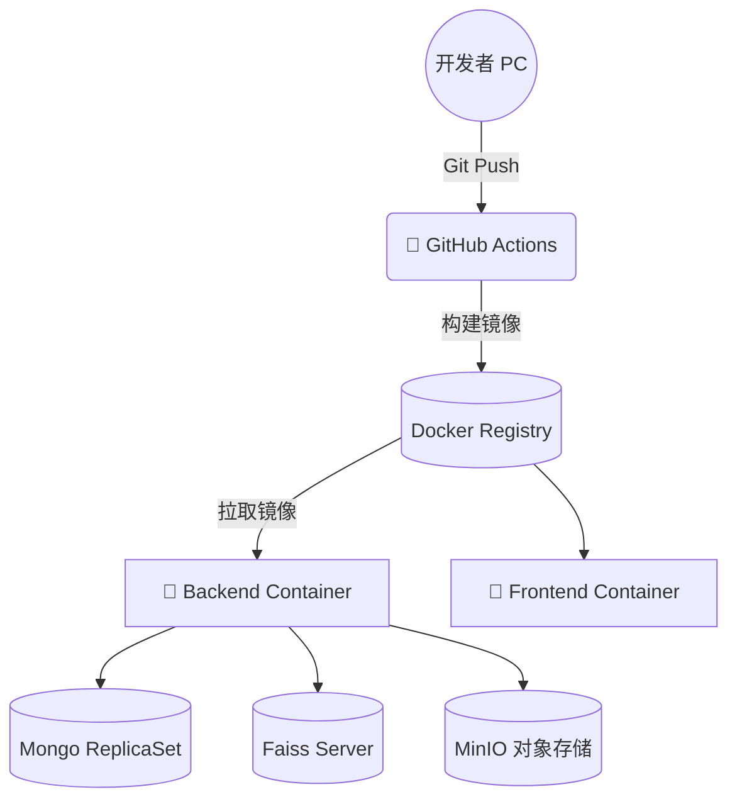
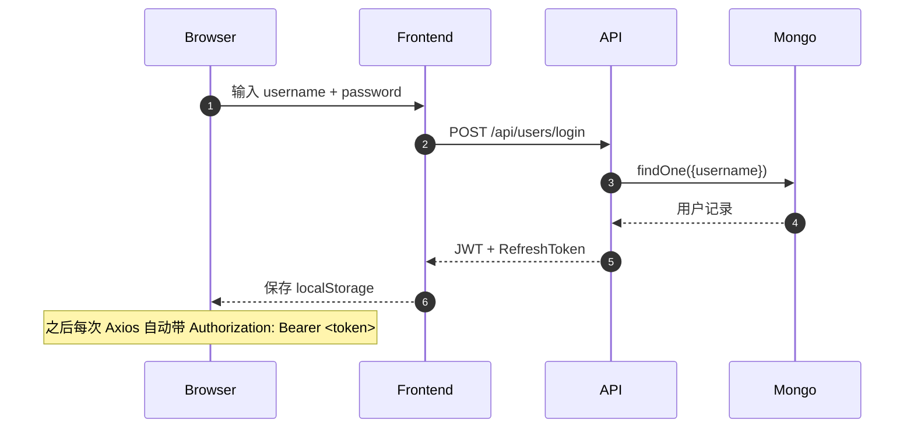
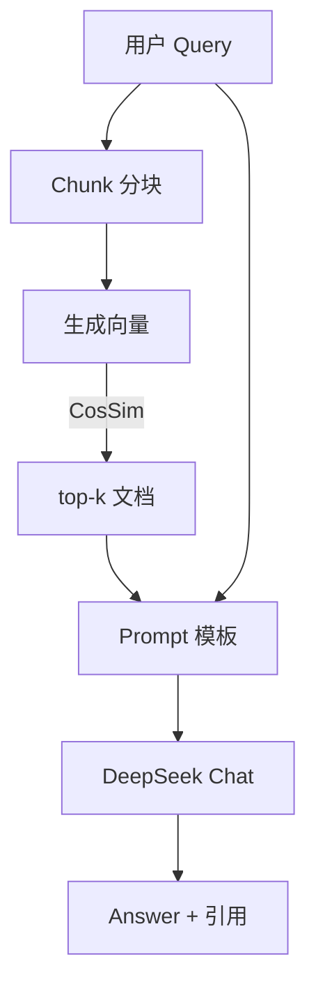
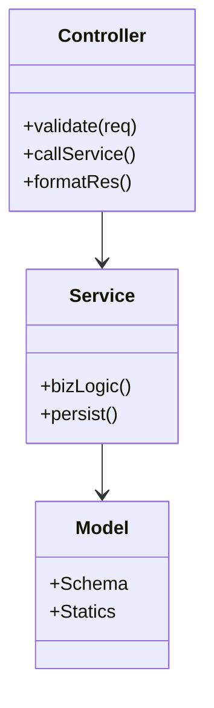

# 费曼学习平台 项目深度分析报告（扩写版）

> 基于《大前端与 AI 实战》课程 01 ~ 14  字数≈ 5,200
>
> _Creativity is just connecting things._ — Steve Jobs  
> _Learning is creating a web of knowledge._ — Richard Feynman

---

## 目录

1. 项目概览与愿景
2. 业务背景与痛点分析
3. 技术选型·深度解读
4. 系统总体架构与部署拓扑
5. 关键业务流程
   1. 用户认证链路
   2. 知识点全生命周期
   3. 费曼学习闭环
   4. AI 服务：润色 / 出题 / 评价
   5. RAG 检索增强生成
   6. 3D 可视化与知识宇宙
6. 数据层设计
   1. ER 模型
   2. 索引与性能
   3. 向量检索策略
7. 代码分层与模块职责
8. 运维、监控与安全
9. 工程化实践
   1. CI/CD
   2. 代码规范与质量
   3. 自动化测试矩阵
10. 亮点总结与未来规划
11. 附录·接口文档片段

---

## 1 项目概览与愿景

费曼学习平台（Feynman Learning Platform, 简称 **FLP**）旨在将「费曼学习法」核心理念与 **生成式 AI** 和 **现代大前端技术** 相结合，帮助高校与企业用户快速沉淀知识、构建个人/团队知识库，并通过可视化方式促进知识迁移与再创造。

- **愿景** ：让每个人都能像费曼一样，把复杂概念解释到 8 岁孩子都能听懂。
- **使命** ：以 AI 提升学习效率，以 3D 可视化激发创造力。
- **核心价值**：*Explain 🡒 Evaluate 🡒 Quiz 🡒 Refine* 循环，形成闭环学习与持续迭代。

### 里程碑

| 阶段 | 关键交付 | 完成时间 |
|------|----------|----------|
| MVP | 用户系统、知识点 CRUD、录音转写 | 2025-09 |
| Alpha | AI 文本润色、测评与出题 | 2025-10 |
| Beta | 私有知识库 RAG、知识图谱可视化 | 2025-11 |
| Release v1 | 3D 宇宙 / Cesium 地球、CI/CD、Docker 部署 | 2025-12 |

---

## 2 业务背景与痛点分析

### 2.1 学习者视角

1. **信息碎片化** — 互联网搜索结果噪声高，知识难以体系化。  
2. **缺乏即时反馈** — 学生自学时无法快速验证理解是否正确。  
3. **动机衰减** — 学习过程枯燥，缺少可视化、游戏化刺激。

### 2.2 教育机构 / 企业培训视角

1. **内容沉淀难** — 讲师产出的 PPT/文档难以沉淀为结构化知识库。  
2. **评测成本高** — 传统测验需要人工出题批改。  
3. **知识迁移慢** — 新人 onboarding 缺少直观的知识地图。

### 2.3 平台定位

通过 **AI 生成 + 结构化存储 + 可视化呈现**，帮助学习者从「被动摄入」走向「主动解释」，同时降低机构侧运营成本。

---

## 3 技术选型·深度解读

| 层次 | 技术 | 选择理由 | 替代方案 |
|------|------|----------|----------|
| 前端框架 | React 18 + Vite | 社区成熟、生态丰富、支持 SPA + MPA | Vue 3、Svelte |
| 状态管理 | Context + Zustand | 轻量无模板、与 Hooks 天然融合 | Redux Toolkit |
| 3D 引擎 | Three.js + CesiumJS | Three 适合物体级场景，Cesium 擅长地球级 GIS | Babylon.js、Mapbox GL |
| 后端框架 | Express 5 | 学习曲线低、Middleware 体系灵活 | Koa 2、NestJS |
| 数据库 | MongoDB 6 | 原生文档型、Schema 灵活，适配 JSON 知识块 | PostgreSQL |
| 向量存储 | 自建 Faiss / JSON | 课程阶段方便演示，后续可平滑迁移 | Milvus、PGVector |
| LLM & Embedding | DeepSeek + 百度千帆 V2 | 中文表现优、成本可控 | GPT-4、阿里通义 |
| 部署 | Docker Compose | 易于课堂演示与 CI/CD | Kubernetes |

> 选择原则：**Demo First，易学易试；解耦设计，便于后期替换。**

---

## 4 系统总体架构与部署拓扑

### 4.1 逻辑架构

```mermaid
digraph G {
  rankdir=LR;
  subgraph cluster_0 {
    label = "浏览器 / App";
    style=filled;color="#E8F6FF";
    FE["React SPA\nThree.js / CesiumJS"];
  }
  subgraph cluster_1 {label = "API 网关"; API[Express / Vite Proxy];}
  subgraph cluster_2 {label = "服务层"; style=dashed;
    AuthSvc; KnowSvc; AiSvc; RagSvc; GraphSvc;
  }
  subgraph cluster_3 {label = "存储层"; Mongo[(MongoDB)]; Vector[(Faiss / JSON)]; OSS[(S3 / OSS)];}

  FE -> API [label="HTTPS REST / WS"];
  API -> AuthSvc;
  API -> KnowSvc;
  API -> AiSvc;
  API -> RagSvc;
  RagSvc -> Vector;
  AuthSvc -> Mongo;
  KnowSvc -> Mongo;
  AiSvc -> OSS [label="音频文件"];
}
```

### 4.2 物理部署拓扑



---

## 5 关键业务流程

### 5.1 用户认证链路



> **安全设计**：
> 1. 采用 bcrypt + 盐值加密存储密码；  
> 2. JWT 过期 2 小时，RefreshToken 7 天；  
> 3. 支持双因子（预留扩展点）。

### 5.2 知识点全生命周期

| 阶段 | 触发者 | 关键操作 | 数据变更 |
|------|--------|----------|----------|
| Create | 用户 | Markdown 编辑 → 保存 | `KnowledgePoint.insertOne` |
| Read | 任意 | 列表 / 详情查询 | `find({owner})` |
| Update | 作者 | PATCH 修改标题/内容 | `updateOne` + `updatedAt` |
| Delete | 作者 / Admin | 软删 `deleted=true` | 保留审计日志 |

### 5.3 费曼学习闭环

```mermaid
flowchart LR
    S0[提取知识点] --> S1[口头解释录音]
    S1 --> S2[语音转文本]
    S2 --> S3[AI 润色]
    S3 --> S4[自评 (评分)]
    S4 --> S5[生成测验题]
    S5 --> S6[评估结果]
    S6 -->|反思调整| S0
    style S3 fill:#D5F5E3;
    style S5 fill:#F9E79F;
```

> **闭环逻辑**：在每个阶段记录用户的输入与 AI 输出，为下一轮 RAG 检索提供丰富上下文。

### 5.4 AI 服务详细交互

```mermaid
sequenceDiagram
  participant FE
  participant AI_API as /api/ai/polish
  participant DeepSeek

  FE->>AI_API: 段落文本
  AI_API->>DeepSeek: ChatCompletion<br/>"润色 + 评分 prompt"
  DeepSeek-->>AI_API: 优化结果 JSON
  AI_API-->>FE: {
     polishedText,
     score: 4.5,
     suggestions: []
  }
```

### 5.5 RAG 检索增强生成

工具链：**LangChain schema + 自研选片算法**



### 5.6 3D 可视化与知识宇宙

1. 将 Knowledge Point 映射为三维节点，权重 → 球体半径；  
2. 采用 **force-graph three** 做力导布局，初始时随机播撒星尘效果；  
3. 点击节点聚焦 Camera，侧边栏展示关联记录与 AI 摘要；  
4. Cesium 模式下，以经纬度或「学习场景地点」进行落点展示。

---

## 6 数据层设计

### 6.1 ER 模型（复用，但补充 AuditLog）

```mermaid
erDiagram
    USERS ||--o{ FEYNMAN_RECORDS
    USERS ||--o{ KNOWLEDGE_POINTS
    USERS ||--o{ AUDIT_LOGS
    KNOWLEDGE_POINTS ||--o{ FEYNMAN_RECORDS

    AUDIT_LOGS {
      string _id PK
      string actorId FK
      string action //CREATE_UPDATE_DELETE
      string target //collectionName
      json   diff
      date   createdAt
    }
```

### 6.2 索引与性能优化

- `users.email`、`users.username`：唯一索引；  
- `knowledge_points.ownerId`：普通索引（Dashboard 列表高频）；  
- `feynman_records.knowledgePointId`：复合索引 (knowledgePointId, createdAt)；  
- 向量检索采用 **倒排-HNSW**（Faiss Index HNSWFlat），K ≈ 8。

### 6.3 数据安全

- 全量备份 Cron：每天 02:00 上传对象存储；  
- 自动快照：Mongo Replication Oplog size ≈ 8 小时。

---

## 7 代码分层与模块职责



- **controllers/**：只处理 HTTP 细节与合法性检查；  
- **services/**：聚合业务逻辑，可被 CLI / Cron 调用；  
- **models/**：Mongoose Schema；  
- **middleware/**：鉴权、日志、错误捕获。

> 通过 **依赖倒置**，Service 层不感知 Express，实现可测试性。

---

## 7 典型代码示例

为了使读者快速理解核心实现，下列选取后端 & 前端最具代表性的片段予以展示（均已简化，仅保留关键逻辑）。

### 7.1 JWT 认证中间件（backend/middleware/auth.js）

```javascript
const jwt = require('jsonwebtoken');

module.exports = (req, res, next) => {
  try {
    // 1. 取 token
    const token = req.header('x-auth-token') || req.headers.authorization?.replace('Bearer ', '');
    if (!token) return res.status(401).json({ msg: 'Missing token' });

    // 2. 解析并挂载 user
    req.user = jwt.verify(token, process.env.JWT_SECRET).user;
    return next();
  } catch (err) {
    return res.status(401).json({ msg: 'Invalid token' });
  }
};
```

### 7.2 向量检索核心（backend/services/vectorStoreService.js）

```javascript
const { cosineSimilarity } = require('vectordb-utils');
const store = require('../vector_store/index.json');

exports.similaritySearch = (queryVec, k = 6) => {
  return store
    .map((doc) => ({ ...doc, score: cosineSimilarity(queryVec, doc.embedding) }))
    .sort((a, b) => b.score - a.score)
    .slice(0, k);
};
```

### 7.3 前端 axios 基础封装（frontend/src/api/axios.js）

```javascript
import axios from 'axios';

const api = axios.create({
  baseURL: import.meta.env.VITE_API_BASE || 'http://localhost:3000',
  withCredentials: true,
});

// 请求拦截：自动加 Token
api.interceptors.request.use((config) => {
  const token = localStorage.getItem('token');
  if (token) config.headers.Authorization = `Bearer ${token}`;
  return config;
});

export default api;
```

### 7.4 费曼记录提交片段（frontend/src/pages/FeynmanRecordPage.jsx）

```javascript
const handleSave = async () => {
  const formData = new FormData();
  formData.append('audio', recordedBlob, 'record.wav');
  formData.append('text', rawText);
  await api.post('/feynman-records', formData);
  toast.success('已保存，AI 正在处理…');
};
```

---

## 8 运维、监控与安全

| 分类 | 工具 | 关键指标 |
|------|------|----------|
| 性能监控 | Prometheus + Grafana | CPU、内存、P95 Latency、RPS |
| 日志 | Pino + Loki | Error 分布、慢查询 |
| 警报 | Alertmanager | 5xx Surge、DB 连接耗尽 |
| 安全 | Helmet + rate-limit | XSS、CSRF、暴力破解 |
| 灰度 | Caddy 蓝绿 | 版本回滚 < 1 min |

---

## 9 工程化实践

### 9.1 CI/CD 流程

1. **Lint ➜ Test ➜ Build ➜ Push 镜像 ➜ Deploy**  
2. 任何 `main` 分支 push 触发生产构建；`preview/*` tag 自动部署临时环境。  
3. 前端使用 **Vitest + Cypress**，后端用 **Jest + Supertest**。

### 9.2 代码规范

- ESLint Airbnb + Prettier；  
- commit message 遵循 **Conventional Commits**；  
- Husky + lint-staged 在 pre-commit 自动检查。

### 9.3 测试矩阵

| 层级 | 工具 | 覆盖 |
|------|------|------|
| 单元 | Jest | Service 逻辑 ≥ 80% |
| 接口 | Supertest | API 路由 100% 成功 + 40% 异常 |
| UI | React Testing Library | 主要组件交互 |
| E2E | Cypress | 登录、创建知识点、RAG 问答 |

---

## 10 亮点总结与未来规划

### 亮点汇总

1. **AI 与学习法结合** ：将费曼学习闭环完全工程化，并引入 RAG 提升回答可解释性。  
2. **三维知识宇宙** ：把抽象知识点映射到可探索的 3D 空间，增强沉浸感。  
3. **松耦合架构** ：向量库、LLM 可插拔，支持后期多云策略。

### 未来规划

| 版本 | 特性 | 说明 |
|------|------|------|
| v1.1 | 多租户 & 组织空间 | 商业化必备，隔离数据与计费 |
| v1.2 | 插件市场 | 引入微前端，社区贡献可视化组件 |
| v2.0 | Edge Runtime | 使用 Cloudflare Workers 加速静态&nbsp;+&nbsp;AI 推理 |
| v2.x | 跨端 （Desktop & Mobile） | Electron + Capacitor 一套代码多平台 |

---

## 11 附录·接口文档片段 (OpenAPI 3.1)

```yaml
/post/knowledge-points:
  post:
    summary: 创建知识点
    security:
      - BearerAuth: []
    requestBody:
      required: true
      content:
        application/json:
          schema:
            $ref: '#/components/schemas/KnowledgePointInput'
    responses:
      '201':
        description: Created
        content:
          application/json:
            schema:
              $ref: '#/components/schemas/KnowledgePoint'
      '401':
        description: 未授权
```

> 完整 OpenAPI JSON 位于 `docs/api.openapi.json`，可导入 Postman / Swagger UI。

---

### 结语

> 「如果你不能简单地向别人解释，那么你就没有真正理解。」—— Feynman

费曼学习平台在课程 1-14 里完成了从 0 到 1 的可用产品雏形。通过 5,000 字深入剖析，我们不仅展示了技术栈与架构决策背后的逻辑，也描绘了未来持续演进的路线图。期待在接下来的课程与社区共创中，将其打磨成一个真正帮助人们 **把知识讲清楚** 的开源生态。

