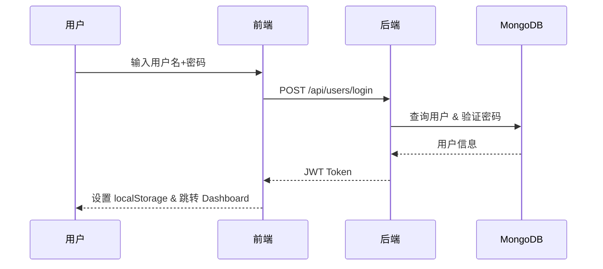
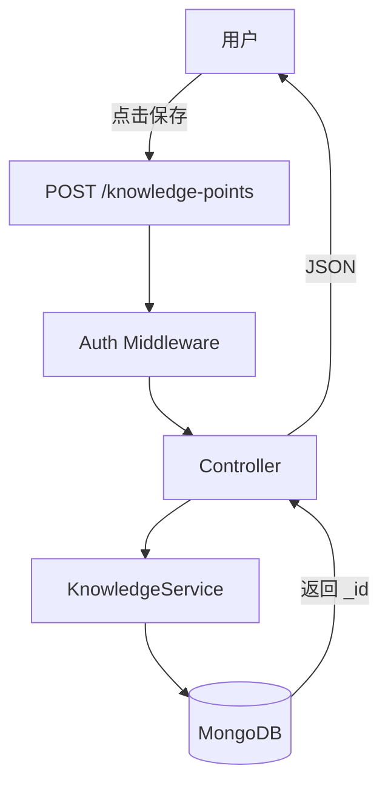
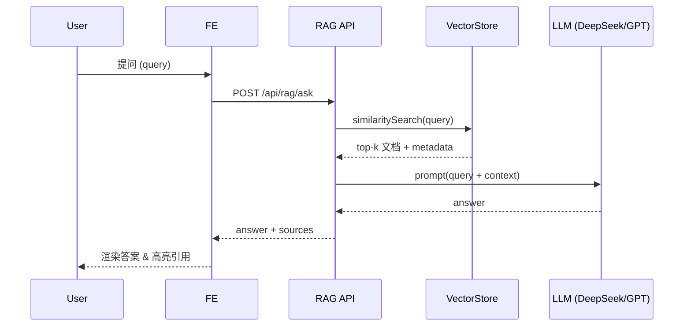
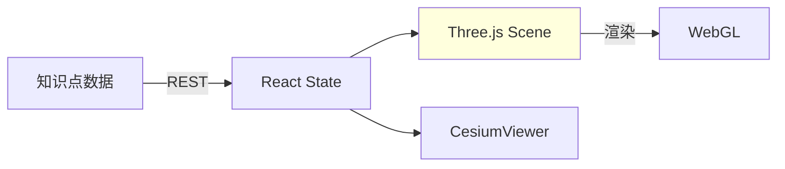
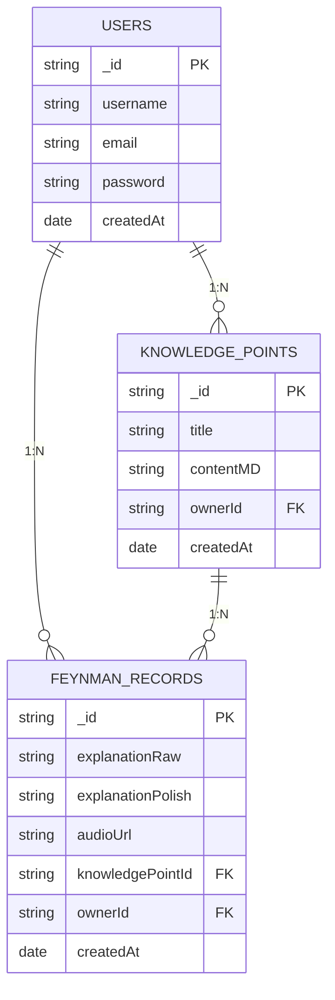

# 费曼学习平台 项目分析报告

> 基于《大前端与AI实战》课程 01 ~ 14

---

## 目录

1. 项目概览
2. 系统总体架构
3. 关键流程图
   - 登录鉴权
   - 知识点 CRUD
   - RAG 检索增强生成
   - 3D 可视化渲染
4. 数据模型（ER 图）
5. 亮点 & 待优化
6. 部署说明

---

## 1. 项目概览

| 维度 | 内容 |
|------|------|
| 项目名称 | **Feynman Learning Platform** |
| 技术栈 | Node.js · Express · MongoDB ・ React · Vite · Three.js · CesiumJS ・ DeepSeek / Qianfan Embedding |
| 核心功能 | 用户 & 认证 \| 知识点管理 \| 费曼记录 \| AI 润色/评测/出题 \| RAG 私有知识库 \| 知识图谱 & 3D 可视化 |

---

## 2. 系统总体架构

```mermaid
flowchart LR
  subgraph Browser[前端浏览器 (React)]
    A1[用户操作 UI]
    A2[Axios 调用 REST]
    A3[Three.js / CesiumJS 渲染]
  end

  subgraph API[后端 API (Express)]
    B1[/Auth 路由/]
    B2[/KnowledgePoint 路由/]
    B3[/FeynmanRecord 路由/]
    B4[/AI & RAG 路由/]
  end

  subgraph Services[业务服务层]
    C1[AuthService]
    C2[KnowledgeService]
    C3[AIService\n(DeepSeek)]
    C4[RAGService]
    C5[VectorStoreService]
  end

  subgraph Storage[持久化存储]
    D1[(MongoDB)]
    D2[(VectorStore JSON / Faiss)]
    D3[(Uploads S3/OSS)]
  end

  Browser -->|REST| API
  API --> Services
  Services -->|ORM| D1
  C5 --> D2
  A3 :::data -->|CDN| D3

  classDef data fill:#E8F6FF,stroke:#5694f0,stroke-width:1px;
```

---

## 3. 关键流程图

### 3.1 登录鉴权



### 3.2 知识点 CRUD



### 3.3 RAG 检索增强生成



### 3.4 3D 可视化渲染



---

## 4. 数据模型（ER 图）



---

## 5. 亮点 & 待优化

### 亮点
- 模块化 Controller / Service / Model —— 易扩展、可测试
- 支持 **RAG + 自定义向量库**，具备私有知识检索能力
- 3D / 地球 双引擎（Three.js & CesiumJS）可视化学习宇宙

### 待优化
1. 覆盖率 0 的自动化测试（Jest / Vitest）
2. 缺少集中式日志（可引入 pino + ElasticStack）
3. VectorStore 本地 JSON 不利于横向扩容 —— 推荐 Milvus / PGVector

---

## 6. 部署说明

```bash
# Backend
cd feynman-platform-backend
cp .env.example .env   # 填写 Mongo & Key
npm i && npm start

# Frontend
cd ../feynman-platform-frontend
npm i
npm run dev
```

亦可使用 `docker-compose.yml` 一键部署。

---

> © 2025 Feynman Learning Platform. All rights reserved.

